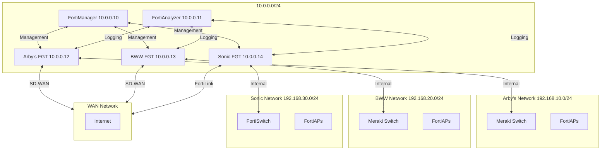

# Fortinet Virtual Lab Environment

A complete virtual lab environment that mirrors the network infrastructure for Arby's, Buffalo Wild Wings, and Sonic brands, featuring Fortinet security products and Meraki networking equipment.


## Overview

This project creates a comprehensive virtual lab environment that simulates the complete network infrastructure for three restaurant brands - Arby's, Buffalo Wild Wings, and Sonic. The lab environment includes virtualized FortiGate firewalls, FortiManager centralized management, FortiAnalyzer logging, and virtualized network devices including FortiSwitches, FortiAPs, and Meraki switches.

The entire environment is containerized and easily deployable, designed specifically for non-technical users to spin up a realistic network environment without deep knowledge of Docker, virtualization, or networking.

## Features

### Multi-Brand Network Environments
- **Arby's**
  - FortiGate firewalls with SD-WAN
  - Meraki switches with dashboard integration
  - FortiAPs for wireless access

- **Buffalo Wild Wings**
  - FortiGate firewalls with SD-WAN
  - Meraki switches with dashboard integration
  - FortiAPs for wireless access

- **Sonic**
  - FortiGate firewalls with FortiLink
  - FortiSwitches with zero-touch provisioning
  - FortiAPs with unified management

### Management Infrastructure
- **FortiManager** - Centralized management for all FortiGate devices
- **FortiAnalyzer** - Centralized logging and reporting
- **Web-based Management** - Intuitive interface for lab control

### Deployment Options
- **Containerized Simulators** - Lightweight, quick-start option
- **Full EVE-NG Virtualization** - Complete virtual environment with real Fortinet VMs
- **Hybrid Approach** - Mix of real and simulated devices

### Automation and Ease of Use
- One-click deployment scripts
- Pre-configured network topologies
- Detailed documentation and examples
- Automated backup and restore

## System Architecture

The system is built using the following technologies:

- **EVE-NG Professional** - Core virtualization platform for Fortinet VMs
- **Docker** and **Kubernetes** - Container platforms for simulators and web UI
- **Node.js** - Backend for API simulators
- **React.js** - Frontend for web management interface

## Deployment Options

This lab can be deployed in two ways:

1. **Containerized Simulators (Recommended for most users)** - Uses Docker containers to simulate network devices
2. **Full EVE-NG Virtualization** - Uses EVE-NG with real Fortinet VMs for a complete experience

### Option 1: Containerized Simulators (Quick Start)

For a quick start with simulated devices:

```bash
# Clone the repository
git clone https://github.com/yourusername/fortinet-virtual-lab.git
cd fortinet-virtual-lab

# Copy example environment file
cp .env.example .env

# Start the lab
./scripts/start-lab.sh
```

Access the web interface at `http://localhost:8080` (default credentials: admin/fortinet123)

### Option 2: EVE-NG Virtualization (Advanced)

For a complete virtualized environment with real Fortinet VMs:

1. **Prerequisites**
   - EVE-NG Professional installed on a server
   - Minimum 32GB RAM, 8+ CPU cores, 500GB storage
   - Virtualization support (Intel VT-x/AMD-V)
   - Required VM images:
     - vFortiManager-7.2.3
     - vFortiAnalyzer-7.2.3
     - vFortiGate-7.2.3

2. **Deploy to EVE-NG**

```bash
# Clone the repository
git clone https://github.com/yourusername/fortinet-virtual-lab.git
cd fortinet-virtual-lab/scripts

# Make the deployment script executable
chmod +x deploy-to-eve-ng.sh

# Deploy to EVE-NG server
./deploy-to-eve-ng.sh [eve-ng-server] [username] [destination-path]
# Example: ./deploy-to-eve-ng.sh 192.168.1.100 root /opt/unetlab/labs/Fortinet-Virtual-Lab
```

3. **Access the Lab**
   - Open EVE-NG web interface
   - Navigate to the deployed lab
   - Start all devices
   - Access each device's console for initial configuration

## System Architecture

### Containerized Simulators Architecture

The containerized version uses the following components:
- **Web UI** - React-based management interface
- **API Gateway** - Central API endpoint for all device communication
- **Device Simulators** - Containerized simulators for FortiSwitch, FortiAP, and Meraki devices

### EVE-NG Virtualization Architecture

The EVE-NG version provides a complete virtualized environment with:
- **FortiManager VM** - Centralized management for all FortiGate devices
- **FortiAnalyzer VM** - Centralized logging and reporting
- **FortiGate VMs** - One for each brand (Arby's, BWW, Sonic)
- **Network Segments** - Separate networks for management and brand traffic

## Network Diagram


- FortiGate, FortiManager, and FortiAnalyzer VM images

### Quick Start with Docker Compose

1. Clone this repository:

```bash
git clone https://github.com/kmransom56/fortinet-virtual-lab.git
cd fortinet-virtual-lab
```

2. Configure environment variables (optional):

```bash
cp .env.example .env
# Edit .env file to customize settings
```

3. Start the environment:

```bash
./scripts/start-lab.sh
```

4. Access the web management interface at http://localhost:8080

### Production Deployment with Kubernetes

For production environments, we recommend using Kubernetes:

1. Configure your Kubernetes context:

```bash
kubectl config use-context your-cluster-context
```

2. Deploy the application:

```bash
kubectl apply -f kubernetes/production/
```

3. Access the application using the configured Ingress host.

## Project Structure

```
/fortinet-virtual-lab/
├── README.md                   # Project overview
├── docker-compose.yml          # Container orchestration
├── .github/                    # GitHub workflows for CI/CD
├── configs/                    # Configuration templates
│   └── fortigate-sample.conf   # FortiGate configuration
├── docs/                       # Documentation
│   └── architecture.md         # Architecture diagrams
├── eve-ng-topology/            # EVE-NG network topologies
│   ├── arbys.unl               # Arby's network
│   ├── bww.unl                 # Buffalo Wild Wings network
│   └── sonic.unl               # Sonic network
├── kubernetes/                 # Kubernetes manifests
│   ├── staging/                # Staging environment
│   └── production/             # Production environment
├── scripts/                    # Management scripts
│   ├── start-lab.sh            # Lab startup script
│   └── stop-lab.sh             # Lab shutdown script
├── simulators/                 # API simulators
│   ├── fortiswitch/            # FortiSwitch simulator
│   ├── fortiap/                # FortiAP simulator
│   └── meraki/                 # Meraki switches simulator
└── ui/                         # Web management interface
```

## Contributing

We welcome contributions to the Fortinet Virtual Lab project! Please see [CONTRIBUTING.md](CONTRIBUTING.md) for details on how to contribute.

## License

This project is licensed under the MIT License - see the [LICENSE](LICENSE) file for details.

## Acknowledgments

- Fortinet for their virtual appliance documentation
- Cisco Meraki for their API documentation
- EVE-NG for the network emulation platform

## Support

For support, please open an issue on the GitHub repository or contact the maintainers directly.
