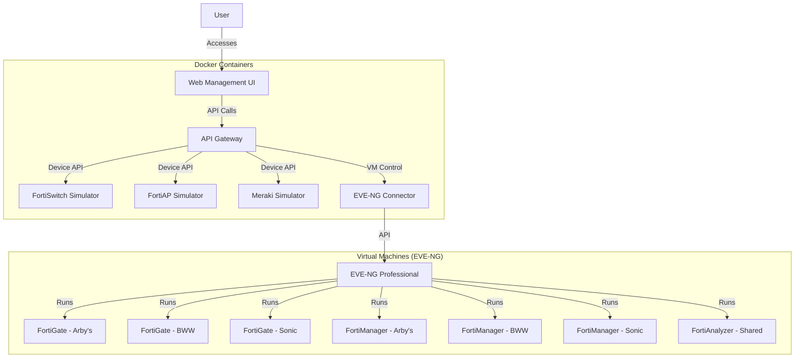
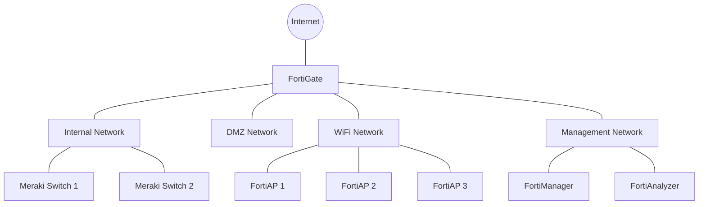
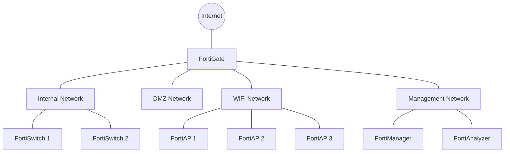
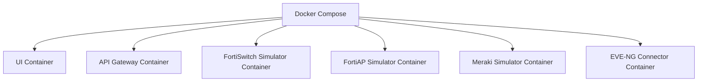
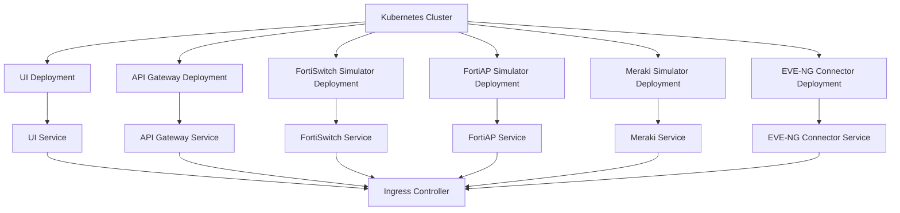

# Fortinet Virtual Lab Architecture

This document outlines the architecture of the Fortinet Virtual Lab environment, designed to simulate network infrastructure for three restaurant brands: Arby's, Buffalo Wild Wings, and Sonic.

## System Overview

The virtual lab consists of several integrated components:

1. **EVE-NG Professional** - Virtualization platform hosting Fortinet VMs
2. **API Simulators** - Node.js applications simulating device APIs
3. **Web Management UI** - React-based frontend for lab management
4. **API Gateway** - Unified API access layer
5. **Containerized Infrastructure** - Docker and Kubernetes deployment options

## Architecture Diagram

## Component Details

### 1. EVE-NG Professional

The core virtualization platform that hosts the Fortinet virtual machines:

- **FortiGate Firewalls**: One per brand, providing security services
- **FortiManager**: One per brand, for centralized management
- **FortiAnalyzer**: Single shared instance for logging and reporting

### 2. API Simulators

Node.js applications that simulate the APIs of various network devices:

- **FortiSwitch Simulator**: Simulates FortiSwitch devices for Sonic
- **FortiAP Simulator**: Simulates FortiAP devices for all brands
- **Meraki Simulator**: Simulates Meraki switches for Arby's and BWW

Each simulator provides realistic API responses and maintains internal state.

### 3. Web Management UI

React-based web interface that provides:

- Dashboard with lab status
- One-click brand environment activation
- Visual network topology maps
- Configuration management

### 4. API Gateway

Centralizes access to all backend services:

- Unified authentication
- Request routing
- Response caching
- Error handling

### 5. EVE-NG Connector

Facilitates communication between the API Gateway and EVE-NG:

- Controls VM lifecycle (start/stop)
- Provisions configurations
- Monitors VM status

## Network Topology

Each brand has a unique network topology:

### Arby's Network

### Buffalo Wild Wings Network

### Sonic Network

## Deployment Options

The Fortinet Virtual Lab offers two deployment options:

### 1. Local Development with Docker Compose

Ideal for individual use or testing, with all components running on a single host:

### 2. Production Deployment with Kubernetes

Scalable deployment for multiple users, with high availability:

## Data Flow

1. User accesses the Web UI
2. Web UI makes API calls to the API Gateway
3. API Gateway routes requests to appropriate services:
   - Device simulators for network device interactions
   - EVE-NG connector for VM management
4. EVE-NG connector communicates with EVE-NG to control VMs
5. Fortinet VMs communicate with each other as per their configuration

## Security Considerations

- All API communication uses HTTPS
- Authentication required for all API access
- Segmentation between different brand environments
- Configuration data encrypted at rest
- Secure access to EVE-NG platform