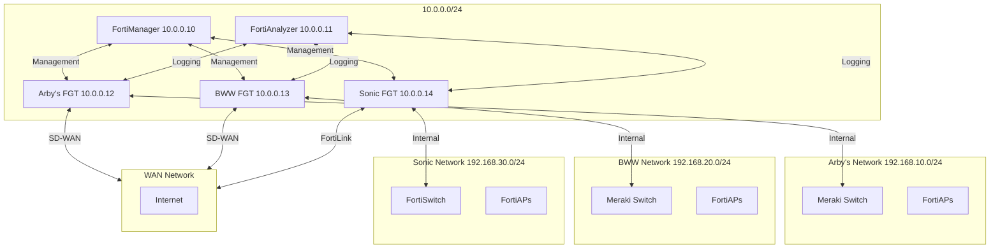

# Fortinet Virtual Lab - EVE-NG Topology

This directory contains the EVE-NG topology and configuration files for the Fortinet Virtual Lab environment, which simulates network infrastructure for three restaurant brands: Arby's, Buffalo Wild Wings (BWW), and Sonic.

## Lab Components

### Management VMs
- **FortiManager (10.0.0.10)**: Centralized management for all FortiGate devices
- **FortiAnalyzer (10.0.0.11)**: Centralized logging and reporting

### FortiGate VMs
- **Arby's FortiGate (10.0.0.12)**: Primary security appliance for Arby's network
- **BWW FortiGate (10.0.0.13)**: Primary security appliance for BWW network
- **Sonic FortiGate (10.0.0.14)**: Primary security appliance for Sonic network

### Network Segments
- **Management (10.0.0.0/24)**: Management network for all devices
- **Arby's (192.168.10.0/24)**: Internal network for Arby's
- **BWW (192.168.20.0/24)**: Internal network for BWW
- **Sonic (192.168.30.0/24)**: Internal network for Sonic
- **WAN (172.16.0.0/16)**: Simulated WAN connections

## Getting Started

### Prerequisites
- EVE-NG Professional installed
- Fortinet VM images (vFortiManager-7.2.3, vFortiAnalyzer-7.2.3, vFortiGate-7.2.3)

### Importing the Lab
1. Copy the `eve-ng-topology` directory to your EVE-NG server
2. Import the `lab-topology.net` file into EVE-NG
3. Ensure all required VM images are available in EVE-NG

### Initial Configuration
1. Start all VMs in the topology
2. Configure each device according to its respective configuration file
3. Verify connectivity between all components

## Configuration Files

- `fortimanager/fmg.conf`: FortiManager configuration
- `fortianalyzer/faz.conf`: FortiAnalyzer configuration
- `fortigates/arbys/arbys-fgt.conf`: Arby's FortiGate configuration
- `fortigates/bww/bww-fgt.conf`: BWW FortiGate configuration
- `fortigates/sonic/sonic-fgt.conf`: Sonic FortiGate configuration

## Network Diagram

## Next Steps

1. Configure SD-WAN on Arby's and BWW FortiGates
2. Set up FortiLink for Sonic's FortiSwitch
3. Configure centralized logging to FortiAnalyzer
4. Implement ADOM-based management in FortiManager
5. Set up automated backups and monitoring
